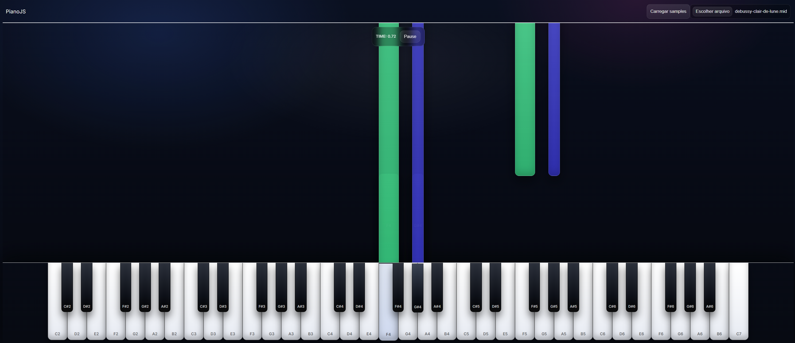

# PianoJS

Um **piano virtual** feito em Angular que permite **tocar notas** (Via simulação em midi ou com samples) e **reproduzir arquivos MIDI** com visualização das notas enquanto o áudio toca.



## Como rodar

```bash
npm install
npm start
```

